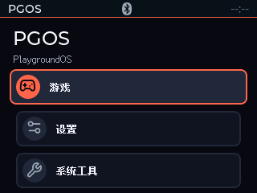
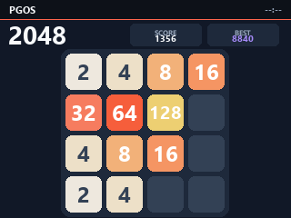
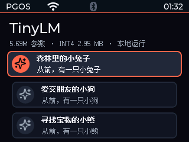
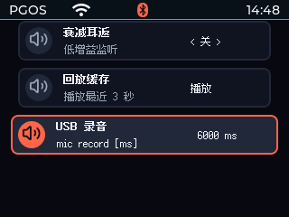
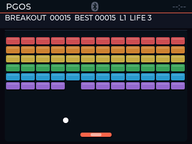

# ESP32 Playground / PlaygroundOS

English | [简体中文](README.zh-CN.md)

ESP32 Playground is a personal hardware laboratory for the QD Electronics
ES3N28P board built around an ESP32-S3 R8N16. Small experiments with display,
input, USB, GPIO, RGB, audio, I2C, Wi-Fi, BLE, and LAN communication have
gradually become PlaygroundOS (PGOS), a lightweight device base with system
services, foreground applications, and one consistent input protocol.

> This repository is a development snapshot of a personal experiment project,
> not production firmware. Feature status follows the source code and the
> records in [`docs/experiments/`](docs/experiments/); hardware results are not
> a guarantee for other boards.

## Features

| Area | Included |
| --- | --- |
| PGOS Shell | LVGL 9.5 desktop, hierarchical menus, status bar, brightness/display timeout, Back and Home navigation |
| Display | ILI9341V, SPI2 at 40 MHz, DMA transfers, RGB565 screenshots, and wireless mirroring |
| Input | Board input, USB CDC console, Xbox BLE gamepads, and bounded event queues |
| Audio | ES8311 playback, 8 kHz mono microphone capture, denoising, VAD, and WAV export |
| Connectivity | 2.4 GHz Wi-Fi station mode, SNTP/PCF8563 RTC, and PGOS Studio TCP channels |
| Games | Snake, Tetris, Breakout, Blackjack, Minesweeper, 2048, and Platformer |
| On-device AI | 7.56M-parameter Chinese TinyLM; the model is mapped from a dedicated flash partition and uses PSRAM on demand |

## Screenshots

These selected captures come from the development board and show the system
shell, games, on-device model UI, and audio tools. The complete capture archive
remains local and is intentionally excluded from Git.

| PGOS Shell | 2048 |
| --- | --- |
|  |  |

| TinyLM presets | Microphone tool |
| --- | --- |
|  |  |

| Breakout |
| --- |
|  |

## Hardware

| Function | Configuration |
| --- | --- |
| MCU | ESP32-S3 R8N16, 16 MB QIO flash, 8 MB OPI PSRAM |
| LCD | ILI9341V, firmware landscape 320x240; CS 10, MOSI 11, SCK 12, MISO 13, DC 46, backlight 45 |
| USB | Native USB CDC on GPIO19/20 |
| RGB | WS2812 on GPIO42 |
| Audio | ES8311; I2C GPIO15/16; I2S MCLK/BCLK/WS/DAC GPIO4/5/7/8; amplifier enable GPIO1 |
| RTC | PCF8563 at 7-bit address `0x51`, sharing the I2C bus with ES8311 |

See the [hardware baseline](docs/HARDWARE.md) for wiring, electrical limits,
and reserved pins. Confirm 3.3 V compatibility, common ground, and power
safety before connecting external modules or speakers.

## Quick start

### Requirements

- [PlatformIO](https://platformio.org/) CLI
- Python 3.10 or newer
- An ES3N28P R8N16 board and a data-capable USB cable

### Build, flash, and monitor

```powershell
pio run -e playground
pio run -e playground -t upload --upload-port COMx
pio device monitor --port COMx --baud 115200
```

PlatformIO restores build dependencies from `platformio.ini` and
`main/idf_component.yml`. Component snapshots, locked revisions, and the
parts that are not yet fully reproducible offline are described in
[`docs/DEPENDENCIES.md`](docs/DEPENDENCIES.md).

### Host tools

```powershell
python -m pip install -r tools/requirements.txt
python tools/playground_console.py --list
python tools/playground_console.py --port COMx
python tools/capture_screen.py --port COMx --output captures/home.png
python tools/capture_microphone.py --port COMx --duration 3000 --output captures/mic-test.wav
```

The USB console supports navigation, direct page access, status queries,
RGB565 screenshots, and microphone recording. Wi-Fi SSIDs, passwords, and
server addresses are configured at runtime through the device UI or console;
they must not be written into source files. `include/secrets.example.h`
contains placeholders only.

### PGOS Studio

```powershell
python -m pip install -r tools/requirements-studio.txt
python tools/pgos_studio.py --listen 0.0.0.0 --port 19000
```

Studio uses TCP port 19000 for control, 19001 for throughput tests, and 19002
for screen mirroring. The current control channels have no TLS or
authentication and should only be used on a trusted home LAN. See
[`SECURITY.md`](SECURITY.md).

## Tests

```powershell
python -m unittest discover -s tools/tests -p "test_*.py"
pio run -e playground
```

Host tests cover game rules, input policy, resource conversion, protocol
tools, and demo data. Passing host tests does not replace real-device checks
for the display, gamepad, audio, wireless coexistence, or long-term stability;
keep evidence in the corresponding experiment record.

## Repository layout

```text
main/       Firmware entry point and ESP-IDF orchestration
src/        PGOS apps, services, games, UI, and fixed third-party source
include/    Public headers and example configuration
boards/     Custom PlatformIO board definitions
tools/      Console, Studio, asset conversion, and host tests
docs/       Hardware baseline, architecture, roadmap, and experiments
licenses/   Font and icon license texts
```

Start with:

- [Feature list](docs/FEATURES.md)
- [Project plan](docs/PROJECT_PLAN.md)
- [PGOS architecture](docs/ARCHITECTURE.md)
- [Wi-Fi and LAN plan](docs/WIFI_PLAN.md)
- [Experiment index](docs/experiments/)
- [Reusable knowledge base](docs/knowledge/README.md)
- [Dependency policy](docs/DEPENDENCIES.md)
- [Third-party notices and source index](THIRD_PARTY_NOTICES.md)

## Distribution boundaries

- The Chinese TinyLM training/export sources are in `src/third_party/esp32_ai/`
  and follow that directory's MIT notice. Roughly 430 MB of raw data,
  checkpoints, intermediate files, and `model.bin` are not in this repository;
  dataset, vocabulary, and model rights must be reviewed separately.
- `src/games/Platformer*` contains level data and pixel resources converted from
  third-party SMB fan projects and uses Mario/Nintendo-related names. These
  files are not automatically covered by the root MIT grant. Redistribution of
  source, firmware, or binaries requires permission or replacement with clearly
  licensed original assets.
- Fonts, icons, VAD, SpeexDSP, and build-time components retain their original
  licenses. See [`THIRD_PARTY_NOTICES.md`](THIRD_PARTY_NOTICES.md) for the full
  scope and direct source links.
- `docs/vendor/` records board-vendor reference material. Do not upload vendor
  EXEs, APKs, flashing tools, or large source packages to a public repository.

## License

Original PlaygroundOS code and documentation, unless a file or directory says
otherwise, are released under the [MIT License](LICENSE). The MIT License does
not cover third-party source, fonts, models/data, vendor material, or the SMB
derived resources. Preserve the applicable copyright and license notices when
redistributing. Project author: [@jie65535](https://github.com/jie65535).
